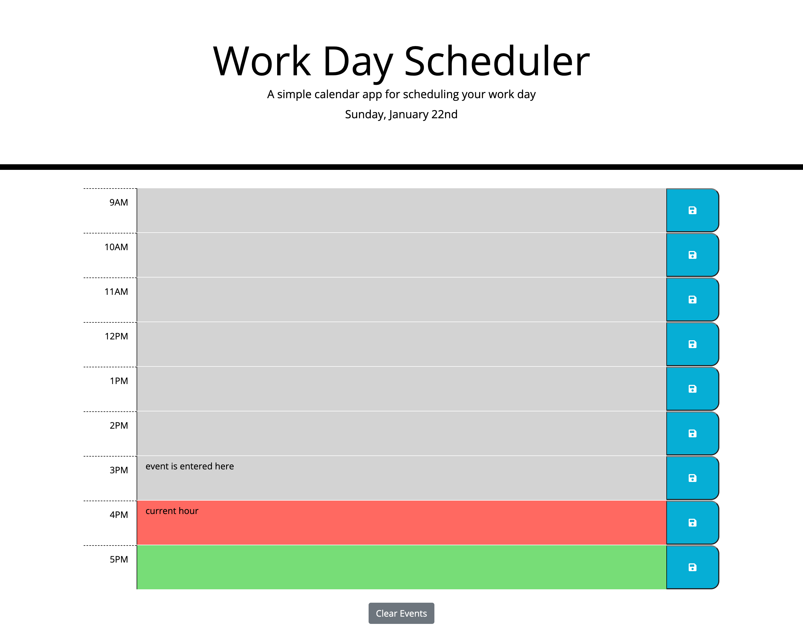

# Work Day Scheduler

## Description
A simple calendar application that runs in the browser and features dynamically updated HTML and CSS powered by jQuery. The application allows a user to save events for each hour of the work day and see them stored when the page is reloaded.

The criteria for this project:

1. Display the current day at the top of the calendar when a user opens the planner
2. Present timeblocks for stand business hours when the user scrolls down
3. Color-code each timeblock based on whether the time is in the past, present or future
4. Allow a user to enter an event when they click on a timeblock
5. Show previously entered events between refreshes of the page

To visit the website, [please click this link.](https://bethanyryalls.github.io/work-day-scheduler/)

## Table of Contents
- [Description](#description)
- [Installation/Usage](#installationusage)
- [Resources](#resources)
- [License](#license)

## Installation/Usage

### Screenshot
The following screenshot shows the application in full.
    

### Users
To visit the website, [please click this link.](https://bethanyryalls.github.io/work-day-scheduler/)

You will be directed to the webpage where you can click on a timeblock and enter an event for that time period, when you click the save button the event will be stored. You'll see the past, present and future timeslots.

### Developers
1. Navigate to the main page of the repository
2. Click the green 'Code' button and copy the SSH or HTTPS key
3. In terminal (Mac) or Git Bash (Windows) clone into the directory you want the repo in using the 'git clone' command followed by pasting your SSH or HTTPS key
4. Open the directory in your code editor
5. Inspect the html, css and js files to see how the application works!

## Resources
- [Stack Overflow](https://stackoverflow.com)
- [Moment.js Docs](https://momentjs.com/docs/)
- [jQuery Docs](https://api.jquery.com/)

## License

